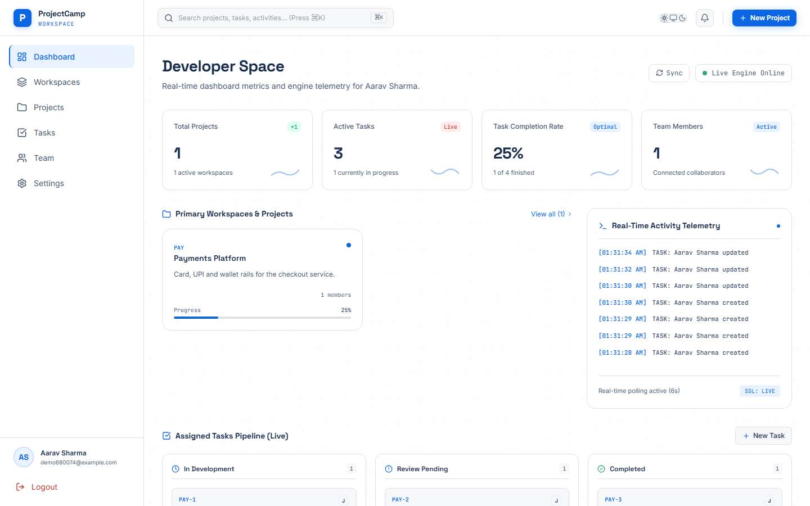
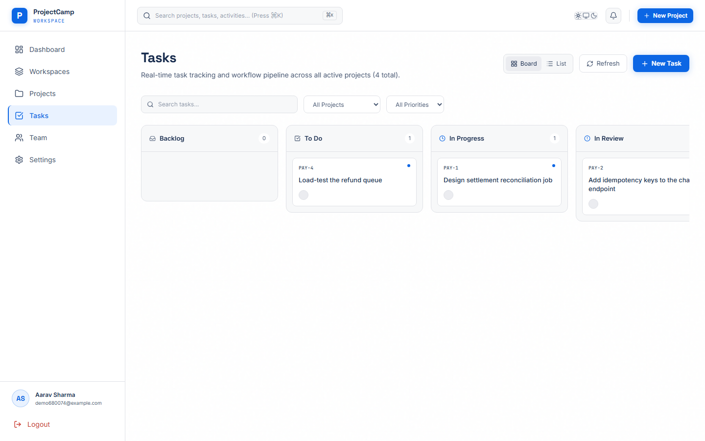
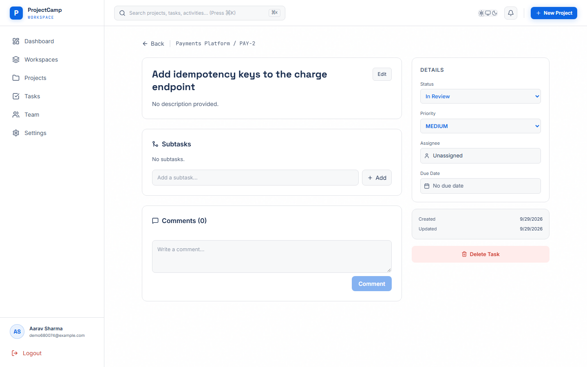
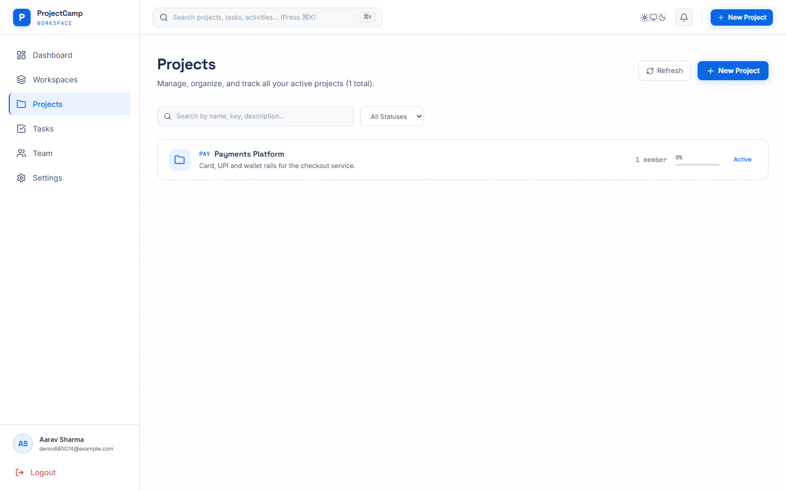
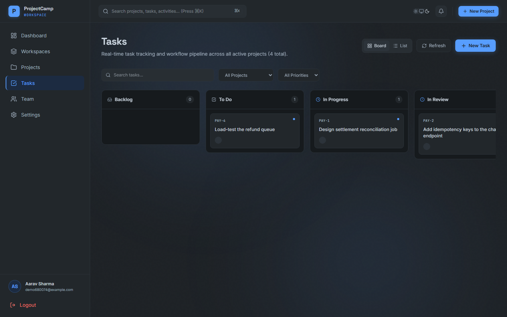

# ProjectCamp

A project-management application for software teams — workspaces, projects, tasks, a Kanban board, and a three-tier role-based permission system enforced on the server.

Built as a full-stack study of the parts that are usually hand-waved in CRUD apps: **how authorization is actually modelled**, how mutations are audited, and how you verify any of it works.

The focus is the **backend** (Node.js, Express 5, MongoDB): the permission matrix, cookie-only sessions with refresh-token rotation, database-enforced invariants and API integration tests that attack it as a second user. The React client is deliberately thin — it exists to exercise that API end to end in a real browser, and every flow it offers is covered by the Playwright suite. API-only features are documented in Swagger at `/api-docs`.



---

## Contents

- [What it does](#what-it-does)
- [Screenshots](#screenshots)
- [Architecture](#architecture)
- [The authorization model](#the-authorization-model)
- [Tech stack](#tech-stack)
- [Repository layout](#repository-layout)
- [Getting started](#getting-started)
- [Testing](#testing)
- [API overview](#api-overview)
- [Engineering decisions](#engineering-decisions)
- [Known limitations](#known-limitations)

---

## What it does

**Working end to end** (covered by the browser test suite):

- **Accounts** — registration, login, logout, JWT access tokens with automatic refresh-token rotation, password reset and email verification through emailed links
- **Workspaces** — create a workspace, invite members, assign workspace roles
- **Projects** — create/update/delete, auto-generated project keys (`PAY`, `NEXT`), per-project membership and roles
- **Tasks** — create, assign, comment, subtasks, auto-generated issue keys (`PAY-1`, `PAY-2`) from an atomic per-project counter
- **Kanban board** — seven canonical statuses with drag-and-drop, plus a list view with filtering
- **Dashboard** — project/task statistics and an activity feed backed by the audit log
- **Theming** — light / dark / system, applied before first paint so there is no flash
- **Authorization** — every project- and workspace-scoped route is guarded server-side; the UI never decides permissions

**Implemented on the server, no UI yet (API-only, see `/api-docs`):** the admin console (users, roles, deactivation, analytics, audit log). See [Known limitations](#known-limitations).

## Screenshots

| Kanban board | Task detail |
|---|---|
|  |  |

| Projects | Board in dark theme |
|---|---|
|  |  |

The whole app ships light and dark themes plus a "follow the OS" mode, driven by
CSS variables rather than duplicated styles — see [Theming](#theming).

## Architecture

Two independent applications talking over a versioned REST API.

```
┌─────────────────────────┐         ┌──────────────────────────────────────┐
│  React 19 SPA (Vite)    │         │  Express 5 API  (/api/v1)            │
│                         │         │                                      │
│  AuthContext ──┐        │  HTTPS  │  ┌────────────────────────────────┐  │
│                ├─► api.js ───────►│  │ verifyJWT        (cookie only) │  │
│  pages/ ───────┘        │ httpOnly│  │   ↓ authorizeProject(res, act) │  │
│                         │ cookies │  │   ↓ validator + validate       │  │
│  react-router           │         │  │   ↓ audit(entity, action)      │  │
└─────────────────────────┘         │  │   ↓ controller ─► notify*()    │  │
                                    │  └────────────────────────────────┘  │
                                    │        │                             │
                                    │        ▼                             │
                                    │   Mongoose                           │
                                    └────────┼─────────────────────────────┘
                                             ▼
                                      MongoDB (9 collections)
```

### The request pipeline

Every protected route is composed declaratively, so authorization is visible at the route rather than buried in a controller:

```js
// backend/src/routes/task.routes.js
router.route("/:projectId")
  .get(authorizeProject("task", "read"), getProjectTasks)
  .post(
    authorizeProject("task", "create"),  // member of this project, allowed to create tasks?
    createTaskValidator(), validate,     // is the body well-formed? (422 if not)
    audit("task", "created"),            // record it once the response succeeds
    createTask                           // business logic, scoped to req.project
  );
```

| Stage | Responsibility |
|---|---|
| `verifyJWT` | Reads the access token from the httpOnly cookie (the only transport), checks the token version, rejects deactivated accounts |
| `authorizeProject` / `authorizeWorkspace` / `authorizeSystem` | Loads the scope once, requires membership, checks the role against the permission matrix, attaches `req.project` |
| validator + `validate` | Type-checks every field (which also blocks NoSQL operator injection) → 422 |
| `audit(entity, action)` | Wraps `res.json` and writes an `AuditLog` entry on success; its arguments are checked at startup |
| controller | Business logic and ownership rules only; throws `ApiError`, responds with `ApiResponse` |

The full request lifecycle, security model and scaling path are written up in [`docs/INTERVIEW_GUIDE.md`](docs/INTERVIEW_GUIDE.md).

### Data model

```
User ──┬── Workspace.members[] ─── Workspace
       │                               │
       └── Project.members[] ────── Project ──┬── Sprint
                                        │     │
                                        │     └── Task ──┬── subtasks[]
                                        │        (issue  ├── Comment (threaded)
                                        │         keys)  └── stateTransitions[]
                                        └── Note

Cross-cutting: Notification · AuditLog
```

## The authorization model

The part of this project worth reading. A user can hold a role at three levels at once, so permissions are resolved to a **single effective role** and then checked against one matrix.

```
System role      super_admin │ hr │ product_manager │ member
Workspace role   owner │ admin │ member │ guest        →  workspace_<role>
Project role     project_manager │ scrum_master │ team_lead │
                 developer │ qa │ client │ viewer
```

**Resolution precedence** (`backend/src/utils/permissions.js`):

1. System super-users (`super_admin`, `hr`, `product_manager`) short-circuit everything
2. Otherwise an explicit **project** role wins
3. Otherwise workspace membership is inherited as `workspace_<role>`
4. Otherwise fall back to the system role, then to `member`

The resolved key is checked against `RolePermissions`, which supports `*:*` and `resource:*` wildcards:

```js
hasPermission("developer", "task", "create");   // true
hasPermission("viewer",    "task", "create");   // false
hasPermission("workspace_developer", "task", "create");  // false — not a real role
```

**It fails closed.** A role that is not in the matrix is denied and logged, rather than inheriting `member` permissions. That last example is a real bug this project had: a project role passed in the workspace argument slot silently resolved to `workspace_developer`, which fell through to `member` rights instead of being rejected. It is now a denial plus a warning, and [a test](backend/tests/security.test.js) pins the behaviour.

**Permissions are added to the matrix, never as ad-hoc checks in controllers.**

## Theming

Themes are one set of CSS variables, redefined under a `.dark` class on `<html>`:

```css
:root      { --surface: #ffffff; --text: #172b4d; --primary: #0c66e4; }
.dark      { --surface: #22272b; --text: #c7d1db; --primary: #579dff; }
@theme inline { --color-surface: var(--surface); }   /* Tailwind utilities */
```

Two things fall out of that:

- **Tailwind utilities follow the theme.** `@theme inline` maps each token *by reference*, so `bg-surface` emits `var(--surface)` rather than baking in a colour.
- **Pre-existing inline styles became theme-aware without being rewritten.** `src/styles/tokens.ts` exports the same variables under the key names the components already used, so roughly 900 `style={{ background: C.surface }}` call sites started following the theme from a single edit. New code uses the Tailwind utilities; the token object shrinks as pages are converted.

A small inline script in `index.html` applies the stored preference before React mounts, so the page never flashes the wrong theme. "System" keeps listening to `prefers-color-scheme` and follows the OS if it changes mid-session.

## Tech stack

**Backend** — Node.js · Express 5 · MongoDB + Mongoose 8 · JWT (`jsonwebtoken`) · bcrypt · Passport (Google/GitHub strategies) · express-validator · express-rate-limit (+ optional Redis store) · Winston · Swagger UI · ESM throughout, no build step

**Frontend** — React 19 · JavaScript (JSX) · Vite · React Router 7 · Tailwind v4 · Framer Motion · Lucide

**Testing** — `node:test` (unit) · Playwright (end-to-end) · `mongodb-memory-server` (ephemeral database for E2E)

**CI** — GitHub Actions per repository

## Repository layout

This repository is a **superproject**. `backend/` and `frontend/` are git submodules with independent histories, pointing at the same remote on different branches (`backend-dev` and `frontend`).

```
.
├── backend/      # Express API        (submodule → branch: backend-dev)
├── frontend/     # React SPA          (submodule → branch: frontend)
├── docs/         # audit, roadmap, architecture, QA status
└── CLAUDE.md     # working notes for the repo
```

Clone with submodules:

```bash
git clone --recurse-submodules https://github.com/Bobin2004/project-management.git
# already cloned?
git submodule update --init --recursive
```

Commit **inside** the submodule first, then commit the updated gitlink at the root — a root-level commit records only the pointer, not the code.

## Getting started

**Prerequisites:** Node.js 20 or newer (CI runs 22), a MongoDB instance (local or Atlas). Redis is optional — without `REDIS_URL` the rate limiter falls back to an in-memory store.

### 1. Backend

```bash
cd backend
npm install
cp .env.sample .env      # then fill it in — see below
npm run dev              # nodemon on $PORT
```

Minimum `.env` to boot:

```ini
MONGO_URL=mongodb://127.0.0.1:27017/projmanage
PORT=8000
CORS_ORIGIN=http://localhost:5173
ACCESS_TOKEN_SECRET=<random string>
ACCESS_TOKEN_EXPIRY=1d
REFRESH_TOKEN_SECRET=<different random string>
REFRESH_TOKEN_EXPIRY=10d
```

`src/config/env.js` validates the secrets at import time and exits if they are missing. Set `PORT=8000` explicitly — the frontend defaults to `http://localhost:8000/api/v1`. SMTP and OAuth variables in `.env.sample` are optional; without SMTP, registration still succeeds and the verification email is skipped.

### 2. Frontend

```bash
cd frontend
npm install
npm run dev              # http://localhost:5173
```

### 3. Optional: seed demo data

```bash
cd backend
npm run seed -- --force  # DESTRUCTIVE: wipes users, workspaces and projects
```

The `--force` flag is deliberate, and the script refuses to run when `NODE_ENV=production`.

## Testing

### Unit tests

```bash
cd backend && npm test
```

Pure-function tests over the permission resolver, pagination clamping, regex escaping and the task-status contract. No database or HTTP fixtures — logic that needs testing lives in `src/utils/` as pure functions.

### End-to-end tests

Playwright drives real Chromium against the **real API**, backed by an ephemeral in-memory MongoDB, so tests never touch a development or production database:

```bash
cd backend  && PORT=8123 npm run e2e:server   # API + throwaway MongoDB
cd frontend && npm run e2e                    # desktop + mobile projects
```

`backend/scripts/e2e-server.mjs` boots `src/app.js` unchanged — same routes, same middleware, same validation — against a database created and discarded per run. The suite provisions its own user through the actual registration UI, so it needs no fixtures.

Covered: registration → login → workspace → project → task → status change → **reload-verified persistence** → logout, plus protected-route redirects and recovery from an expired token.

> `frontend/.env.e2e` pins the test run to the ephemeral API. It must not be removed — Vite's committed `.env` points at port 8000, and mode-specific env files take precedence over anything passed at runtime.

### CI

Each submodule runs its own GitHub Actions workflow on push: the backend parses every source file and runs the unit tests; the frontend typechecks, lints and builds. The E2E suite is not in CI because it needs both repositories checked out simultaneously.

## API overview

All routes are under `/api/v1`. Interactive docs are served at **`/api-docs`** (Swagger UI, from `backend/docs/swagger.yaml`).

| Router | Highlights |
|---|---|
| `/auth` | register · login · logout · refresh-token · current-user · change/forgot/reset password · verify-email · Google & GitHub OAuth |
| `/workspaces` | CRUD · invite member · update/remove member |
| `/projects` | CRUD · members · roles · pending invitations · accept/reject |
| `/tasks/:projectId` | task CRUD · subtasks · assignment · status transitions |
| `/projects/:projectId/sprints` | sprint CRUD · start/complete · burndown · velocity |
| `/projects/:projectId/tasks/:taskId/comments` | threaded comments · reactions |
| `/notes/:projectId` | project notes |
| `/dashboard` | aggregated project/task statistics for the signed-in user |
| `/notifications` | list · unread count · mark read |
| `/search` | multi-entity search, scoped to the caller's projects |
| `/admin` | user list · role/status changes · analytics · audit log |
| `/healthcheck` | liveness |

**Response envelope.** Every response is an `ApiResponse`; every failure is an `ApiError` surfaced by a global handler that maps Mongoose `CastError` → 400, duplicate key (`11000`) → 409 and `ValidationError` → 400, and includes a stack trace only in development.

## Engineering decisions

Choices worth explaining, including the trade-offs:

**No service layer.** Controllers (66–476 lines) call models directly. A service tier would add a hop without removing duplication at this size; shared logic lives in `src/utils/` instead. Revisit if controllers outgrow their current scope.

**Permissions as data, not code.** `RolePermissions` is a lookup table rather than branching logic, so adding a role means editing one object. The cost is that wildcards (`resource:*`) make it possible to grant more than intended if entries are written carelessly.

**Enums in exactly one place.** `src/utils/constants.js` is the single source for statuses, roles, priorities and board columns. The frontend mirrors the task statuses in `src/lib/taskStatus.js`, and a backend test fails if the two drift — the repositories cannot import from each other, so the test is the contract. This exists because the board once offered a `review` column while the schema enum defined `in_review`; every drag to that column failed with a 400.

**Audit by middleware, not by hand.** `audit()` wraps `res.json` and writes the entry on success, so controllers do not repeat logging and cannot forget it. Writes are fire-and-forget: an audit failure must never fail the user's request. Entries expire after 365 days via a TTL index.

**Notifications by direct call, not an event bus.** Controllers call `notifyTaskAssigned(...)` etc. from `services/notification.service.js` after a successful write, without awaiting. An in-process event bus used to sit here; its handlers were registered by an import nobody performed, so no notification was ever created. In a single process a function call gives the same decoupling with no way to silently go nowhere, and the service functions are the seam where a job queue would go if notifications ever need retries.

**Invariants in the database.** Unique `{workspace, key}` for project keys, unique `{project, issueNumber}` for issue numbering, a *partial* unique index that allows only one active sprint per project, and `{owner, slug}` for workspace names. A check in application code can race; a unique index cannot.

**Issue keys from an atomic counter.** `Project.findByIdAndUpdate({ $inc: { taskSequence: 1 } })` allocates the number so concurrent creates cannot collide. A failure after the increment leaves a gap in numbering, which is harmless, so no transaction is used.

## Known limitations

Tracked honestly rather than hidden — details and finding IDs are in [`docs/PROJECT_AUDIT.md`](docs/PROJECT_AUDIT.md), with priorities in [`docs/PRODUCTION_ROADMAP.md`](docs/PRODUCTION_ROADMAP.md).

**Security**
- One session per user: logging in on a second device ends the first (the refresh-token slot is single).
- `/auth/check-email` reveals whether an email is registered (a deliberate UX trade-off, rate-limited).
- The local development `.env` must use different access and refresh secrets; the server warns if they are equal and refuses to start in production.

**Data integrity**
- Multi-document deletes are ordered children-first and are safe to retry, but they are not atomic (no transactions: the local development database is not a replica set).

**Frontend**
- Written in plain JavaScript (converted from TypeScript on 2026-10-03), so there is no compile-time check of API payload shapes; the backend's runtime validation and the end-to-end suite are the safety net.
- Data fetching is per-page `useEffect` + `useState`: no shared cache, deduplication or invalidation.
- The dashboard activity feed polls; it is not a live socket connection.

**Unfinished flows**
- Google/GitHub sign-in needs provider credentials on the API; the buttons are hidden unless the client sets `VITE_OAUTH_ENABLED=true`.
- The admin console has an API but no UI (it needs a `super_admin`, which the API deliberately cannot create).

**Not yet done**
- Not deployed; there is no public demo.
- No Dockerfile or deployment configuration.
- Coverage is thin: unit tests cover pure utilities, E2E covers the critical path, and there are no API integration tests.

## License

Not currently licensed. All rights reserved by the author.
